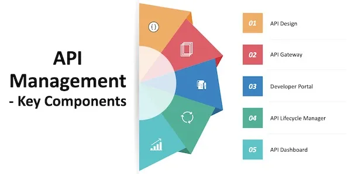

# HTTP
Hypertext Transfer Protocol -> is a communication protocal. It is used to send and receive webpages and files on the internet.

# API
- API stands for Application Programming Interface, API’s communicate through a set of rules/protocols that defines how computers, applications, or machines can talk to each other.
- It works over the internet via HTTP protocol which works on top of the TCP/IP protocol

# API Management
API management is the process of designing, publishing, documenting and analyzing APIs in a secure environment to ensure APIs are consumable and secure.
 

## Types Of API
- `Open APIs:` Also known as Public API, there are no restrictions to access these types of APIs because they are publicly available.
- `Partner APIs:` A developer needs specific rights or licenses to access this type of API because they are not available to the public.
- `Internal APIs:` Also known as Private APIs, only internal systems expose this type of API.

## HTTP v API

https://medium.com/@krunalchauhan_/article-worth-reading-on-what-is-an-api-what-is-a-rest-api-and-deep-diving-into-rest-api-fea074dacaed
