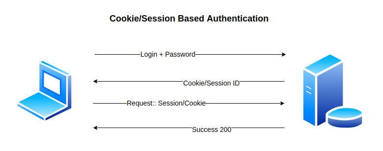

## Sesssion Based Authentication


- In the session based authentication, the server will create a session for the user after the user logs in. - The session id is then stored on a cookie on the user’s browser.
- While the user stays logged in, the cookie would be sent along with every subsequent request. 
- The server can then compare the session id stored on the cookie against the session information stored in the memory/db to verify user’s identity and sends response with the corresponding state.


### These packages for mongodb session base authentication
- `express` - For creating our server
- `express-session` - For creating our session based authentication
- `mongoose` - To Connect to our MongoDB Database
- `connect-mongo` - For storing our sessions in MongoDB Database


## Create a nodejs application and connect it with mongodb using mongose ORM
    
```
const express = require('express');
const app = express();
const mongoose = require('mongoose');
const MongoStore = require('connect-mongo');
const session = require('express-session');

await mongoose.connect('your_mongo_url', (err, db) => {
            console.log('MongoDB Connected....');
    });

app.get('/', (req,res)=>{
    res.send('<h1>Hello World!</h1>')  
})

app.listen(5000, () => console.log(`Server 🔥🔥🔥 up on 5000`));

```

## Configure the MongoDB Store for session storage.

```
app.use(session({
    secret: 'this is the secret of happy life',  
    resave: false,
    saveUninitialized: true,
    cookie: { maxAge: oneDay },
    store: MongoStore.create({
        mongoUrl: 'your_mongo_url'
    })
}));    
```

This block of code used the `express-session` package to create an empty Session object for a request.
 
So this will create a new empty session inside our mongodb database with a collection name sessions.


## Route for login


```
app.post('/login', async (req, res) => {
    const { username, password } = req.body;    
try {
        let user = await User.findOne({ email: username })
        // store unique session id inside the req.session
        req.session.userId = user._id;
        console.log(req.session);

        res.redirect('/dashboard')

    } catch (err) {
        console.log(err);
        res.json({ msg: 'Server Error! Please reload page' });
    }
})
```

- Now when the user logs into its account with username and password we will match password and username from DB
- `req.session.userId` is storing the unique _id of the user in the session and server creates a unique session id which is placed in the cookie which will be sent back to the client and stored in the client's browser 
- Now whenever the client will make any request to the server the header will contain this `cookie` and we at server side are able to `authenticate` that particular user using that `cookie in the header` and obtaining the `userId of the user`.


## Authenticating user using a middleare
```
module.exports.authentication = async (req, res, next) => {
    const userId = req.session.userId;
    if (!userId) {
        return res.redirect('/login?q=session-expired');
    }
    try {
        let user = await User.findById(userId);
        if (!user) {
            return res.redirect('/login?q=session-expired');
        }
        next();
    } catch (err) {
        console.log(err);
        res.json({ msg: 'Server error. Please reload page after sometime' })
    }
};
```
- Whenever there's a request from user we will get the session id and check form DB 
- In case there's no userid in session, we will regirect to login
- If it's valid we will continue with the request


## Advantages of Session Based Authentication
- Small sized value
- Easy implementation
- Auto expire
## Disadvantages of Session Based Authentication
- Not scalable, as session information is stored inside database. 
